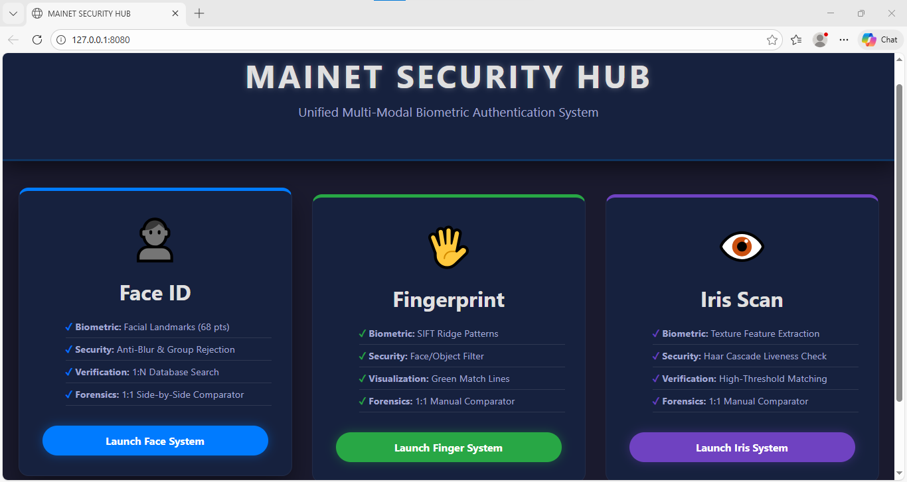
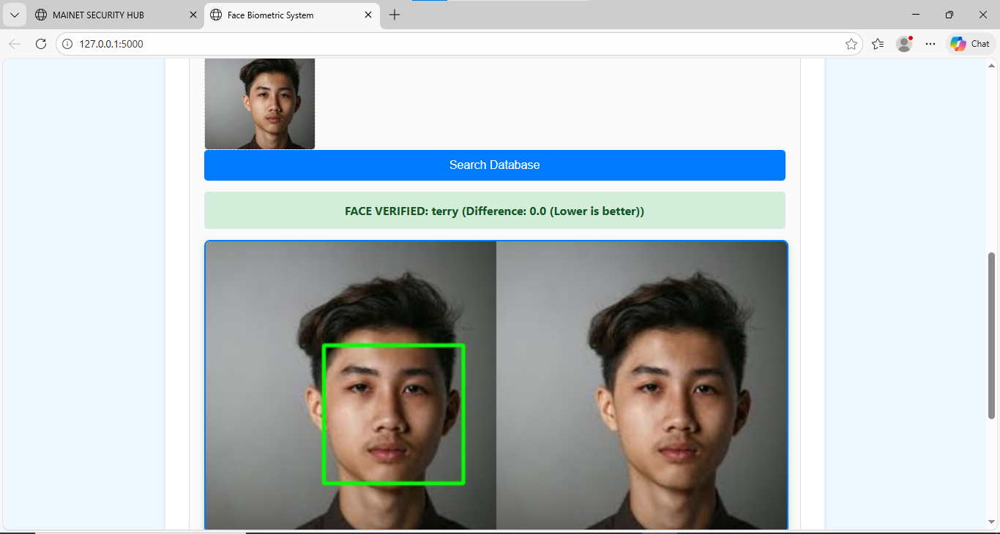
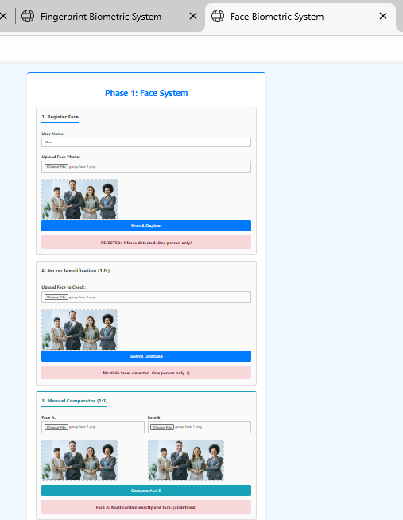
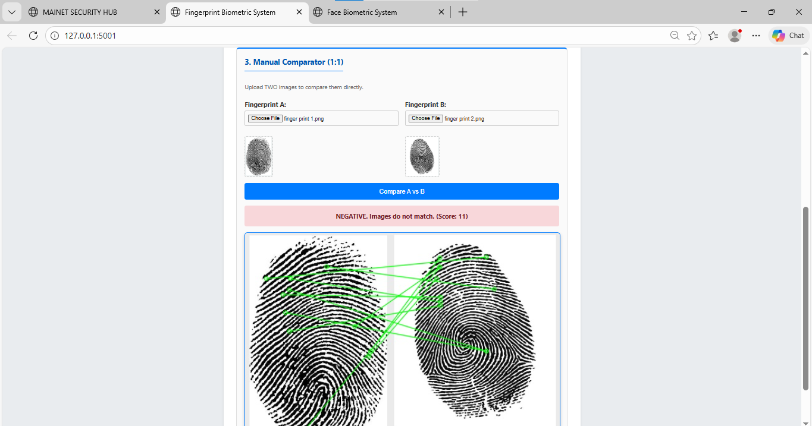
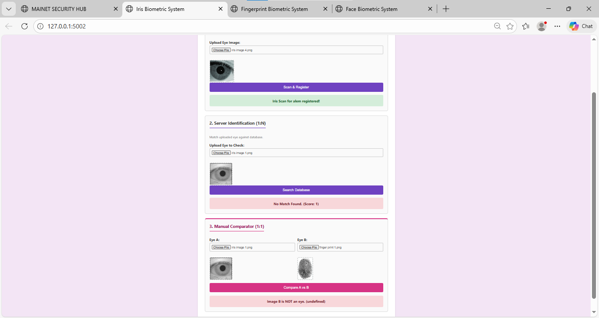

# 🛡️ Mainet Unified Biometric Identity System (MUBIS)

> **A Multi-Modal Biometric Security Hub featuring Face, Fingerprint, and Iris recognition with forensic analysis tools.**


*(Screenshot of the Central Command Hub)*

## 📖 Project Overview

The **Mainet Unified Biometric System** is a modular, full-stack security application designed to demonstrate **Multi-Factor Authentication (MFA)**. Unlike monolithic systems, MUBIS uses a microservices architecture where each biometric modality operates as an independent server, orchestrated by a central dashboard.

**Key Capabilities:**
*   **Face Recognition:** 68-point landmark detection with anti-spoofing (Group Photo Rejection).
(screenshots/group_face _detection.png)
*   **Fingerprint Forensics:** SIFT (Scale-Invariant Feature Transform) algorithm with 1:1 manual comparator and ridge-matching visualization.
*   **Iris Scanning:** Texture pattern analysis with Haar Cascade Liveness Detection to prevent spoofing.
*   **Forensic Visualization:** Visualizes the specific "Match Points" (Green Lines) between a suspect image and the database record.

---

## 🏗️ System Architecture

The project follows the **"Isolate and Perfect"** design philosophy.

```text
/Unified-Biometric-Hub
│
├── /ma_central_hub        # Port 8080: The React-style Dashboard
├── /ma_bi_system          # Port 5000: Face Recognition Engine (Dlib/Face_Rec)
├── /ma_fingerprint_system # Port 5001: Fingerprint Engine (OpenCV/SIFT)
└── /ma_iris_system        # Port 5002: Iris Engine (OpenCV/Haar)
```

**Database Strategy:**
*   **PostgreSQL** backend.
*   Stores **Biometric Templates** (JSON arrays of mathematical embeddings) for speed.
*   Stores **Base64 Images** for forensic side-by-side comparison.

---

## 📸 Features & Demos

### 1. Face Recognition Module
**Tech:** `dlib`, `face_recognition`, `numpy`
*   **Gatekeepers:** Automatically rejects blurry images or photos with multiple people.
*   **Visualization:** Draws facial landmarks on the input and database image side-by-side.




### 2. Fingerprint Forensic Module
**Tech:** `OpenCV`, `SIFT Algorithm`
*   **Manual Comparator:** Allows the user to upload two separate images (1:1 verification) to see if they match.
*   **Visual Proof:** Draws green connection lines between matching ridge bifurcations.



### 3. Iris Security Module
**Tech:** `OpenCV`, `Haar Cascades`
*   **Liveness Check:** Uses Object Detection to ensure the uploaded image is an eye, rejecting fingerprints or random objects.
*   **Texture Matching:** High-threshold matching for complex iris patterns.



---

## ⚙️ Installation Guide

### Prerequisites
*   Python 3.10 or 3.11 (Recommended)
*   PostgreSQL
*   Visual Studio Code

### Step 1: Database Setup
Create a PostgreSQL database named `ma_bi_system` and run the following SQL to create the tables:

```sql
-- Users Table (Face)
CREATE TABLE users (
    id SERIAL PRIMARY KEY,
    full_name VARCHAR(255) NOT NULL,
    biometric_template TEXT NOT NULL,
    original_image TEXT
);

-- Fingerprints Table
CREATE TABLE fingerprints (
    id SERIAL PRIMARY KEY,
    full_name VARCHAR(255) NOT NULL,
    fingerprint_template TEXT NOT NULL,
    original_image TEXT
);

-- Iris Table
CREATE TABLE iris (
    id SERIAL PRIMARY KEY,
    full_name VARCHAR(255) NOT NULL,
    iris_template TEXT NOT NULL,
    original_image TEXT
);
```

### Step 2: Install Dependencies
Each module runs in its own Virtual Environment (`venv`) to prevent conflicts.

#### 1. Face System (`/ma_bi_system`)
*Note: Requires `dlib` pre-compiled wheel for Windows.*
```bash
cd ma_bi_system
python -m venv venv
venv\Scripts\activate
# Install the dlib wheel file first, then:
pip install Flask psycopg2-binary face_recognition "numpy<2" Pillow opencv-python
```

#### 2. Fingerprint System (`/ma_fingerprint_system`)
```bash
cd ma_fingerprint_system
python -m venv venv
venv\Scripts\activate
pip install Flask psycopg2-binary numpy opencv-python Pillow
```

#### 3. Iris System (`/ma_iris_system`)
```bash
cd ma_iris_system
python -m venv venv
venv\Scripts\activate
pip install Flask psycopg2-binary numpy opencv-python Pillow
```

#### 4. Central Hub (`/ma_central_hub`)
```bash
cd ma_central_hub
python -m venv venv
venv\Scripts\activate
pip install Flask
```

---

## 🚀 How to Run

The system includes a **One-Click Launcher** for Windows.

1.  Navigate to the root directory.
2.  Double-click **`Start_System.bat`**.
3.  Four terminal windows will open (initializing all servers).
4.  The dashboard will automatically launch in your default browser at `http://127.0.0.1:8080`.

---

## 🛠️ Troubleshooting

**Issue: "Unsupported image type" or Dlib errors.**
*   **Fix:** This is caused by a Numpy version conflict. Ensure you install the older version in the Face System environment:
    `pip install "numpy<2"`

**Issue: "Green Lines" not showing.**
*   **Fix:** Ensure you are uploading high-quality fingerprint images. The SIFT algorithm requires a minimum of 40 keypoints to generate a reliable match visualization.

---

## 👨‍💻 Author

**Developed by TesfayeAb**
*   **Concept:** Unified Biometric Security using Microservices.
*   **Status:** Completed & Tested (Phase 4).